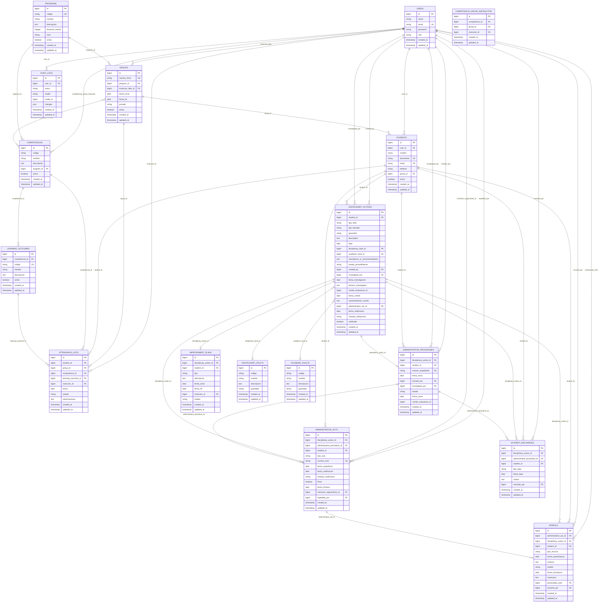

# Estructura de Base de Datos - Sistema de Gestión Académica SENA

## Tablas Principales

### 1. `users` - Usuarios del Sistema
**Descripción:** Almacena todos los usuarios del sistema (admin, coordinadores, instructores, aprendices).

| Columna | Tipo | Descripción |
|---------|------|-------------|
| `id` | bigint | Clave primaria, Identificador único |
| `name` | string | Nombre completo del usuario |
| `email` | string | Correo electrónico (único, usado para iniciar sesión) |
| `password` | string | Contraseña encriptada |
| `role` | string | Rol del usuario: `admin` (administrador), `coordinator` (coordinador), `instructor` (instructor), `student` (aprendiz) |
| `remember_token` | string | Token para mantener la sesión activa |
| `email_verified_at` | timestamp | Fecha de verificación del correo electrónico |
| `created_at` | timestamp | Fecha de creación del registro |
| `updated_at` | timestamp | Fecha de última actualización del registro |

**Relaciones:**
- `Tiene muchos` → `groups` (grupos donde es instructor líder)
- `Tiene muchos` → `disciplinary_actions` (llamados de atención creados o investigados)
- `Tiene muchos` → `administrative_procedures` (procedimientos iniciados o investigados)
- `Tiene muchos` → `administrative_acts` (actos expedidos o seguimiento)
- `Tiene muchos` → `appeals` (recursos presentados o resueltos)
- `Tiene muchos` → `audit_logs` (registros de auditoría)
- `Pertenece a muchos` → `competencias` (a través de `competencia_group_instructor`)

---

### 2. `programs` - Programas de Formación
**Descripción:** Programas técnicos o tecnológicos del SENA.

| Columna | Tipo | Descripción |
|---------|------|-------------|
| `id` | bigint | Clave primaria, Identificador único |
| `codigo` | string | Código único del programa (ejemplo: "228106") |
| `nombre` | string | Nombre del programa de formación |
| `descripcion` | text | Descripción detallada del programa |
| `duracion_meses` | integer | Duración del programa en meses |
| `nivel` | string | Nivel de formación: "Técnico" o "Tecnología" |
| `activo` | boolean | Estado del programa (activo o inactivo) |
| `created_at` | timestamp | Fecha de creación del registro |
| `updated_at` | timestamp | Fecha de última actualización del registro |

**Relaciones:**
- `Tiene muchos` → `groups` (fichas del programa)
- `Tiene muchos` → `competencias` (competencias del programa)

---

### 3. `groups` - Fichas/Grupos
**Descripción:** Grupos o fichas de formación dentro de un programa.

| Columna | Tipo | Descripción |
|---------|------|-------------|
| `id` | bigint | Clave primaria, Identificador único |
| `numero_ficha` | string | Número de ficha o grupo (único) |
| `program_id` | bigint | Clave foránea hacia `programs.id` (programa al que pertenece) |
| `instructor_lider_id` | bigint | Clave foránea hacia `users.id` (instructor líder asignado) |
| `fecha_inicio` | date | Fecha de inicio del grupo |
| `fecha_fin` | date | Fecha de finalización del grupo |
| `jornada` | string | Jornada de formación: "mañana", "tarde", "noche", "mixta" |
| `activo` | boolean | Estado del grupo (activo o inactivo) |
| `created_at` | timestamp | Fecha de creación del registro |
| `updated_at` | timestamp | Fecha de última actualización del registro |

**Relaciones:**
- `Pertenece a` → `programs` (programa al que pertenece)
- `Pertenece a` → `users` (instructor líder)
- `Tiene muchos` → `students` (aprendices del grupo)
- `Tiene muchos` → `attendance_lists` (listas de inasistencias)
- `Pertenece a muchos` → `competencias` (a través de `competencia_group_instructor`)

---

### 4. `students` - Aprendices
**Descripción:** Estudiantes del sistema.

| Columna | Tipo | Descripción |
|---------|------|-------------|
| `id` | bigint | Clave primaria, Identificador único |
| `user_id` | bigint | Clave foránea hacia `users.id` (usuario de acceso al sistema) |
| `nombre` | string | Nombre completo del aprendiz |
| `documento` | string | Número de documento de identidad (único) |
| `email` | string | Correo electrónico del aprendiz (único) |
| `telefono` | string | Número de teléfono (opcional) |
| `group_id` | bigint | Clave foránea hacia `groups.id` (ficha a la que pertenece) |
| `activo` | boolean | Estado del aprendiz (activo o inactivo) |
| `created_at` | timestamp | Fecha de creación del registro |
| `updated_at` | timestamp | Fecha de última actualización del registro |

**Relaciones:**
- `Pertenece a` → `users` (usuario de acceso)
- `Pertenece a` → `groups` (ficha)
- `Tiene muchos` → `attendance_lists` (inasistencias)
- `Tiene muchos` → `disciplinary_actions` (llamados de atención)
- `Tiene muchos` → `administrative_procedures` (procedimientos administrativos)
- `Tiene muchos` → `administrative_acts` (actos administrativos)
- `Tiene muchos` → `student_discharges` (bajas de estudiantes)
- `Tiene muchos` → `appeals` (recursos de apelación)

**Nota:** La contraseña del usuario asociado es el número de documento del aprendiz.

---

### 5. `competencias` - Competencias
**Descripción:** Competencias de los programas de formación.

| Columna | Tipo | Descripción |
|---------|------|-------------|
| `id` | bigint | Clave primaria, Identificador único |
| `codigo` | string | Código de la competencia (ejemplo: "240201500") |
| `nombre` | string | Nombre de la competencia |
| `descripcion` | text | Descripción detallada de la competencia |
| `program_id` | bigint | Clave foránea hacia `programs.id` (programa al que pertenece) |
| `activo` | boolean | Estado de la competencia (activa o inactiva) |
| `created_at` | timestamp | Fecha de creación del registro |
| `updated_at` | timestamp | Fecha de última actualización del registro |

**Relaciones:**
- `Pertenece a` → `programs` (programa al que pertenece)
- `Tiene muchos` → `learning_outcomes` (resultados de aprendizaje)
- `Pertenece a muchos` → `groups` (a través de `competencia_group_instructor`)
- `Pertenece a muchos` → `users` (instructores, a través de `competencia_group_instructor`)
- `Tiene muchos` → `attendance_lists` (inasistencias registradas)

---

### 6. `learning_outcomes` - Resultados de Aprendizaje (RAs)
**Descripción:** Resultados de aprendizaje asociados a competencias.

| Columna | Tipo | Descripción |
|---------|------|-------------|
| `id` | bigint | Clave primaria, Identificador único |
| `competencia_id` | bigint | Clave foránea hacia `competencias.id` (competencia a la que pertenece) |
| `codigo` | string | Código del resultado de aprendizaje (ejemplo: "RA24020150001") |
| `nombre` | string | Nombre del resultado de aprendizaje |
| `descripcion` | text | Descripción detallada del resultado de aprendizaje |
| `activo` | boolean | Estado del resultado de aprendizaje (activo o inactivo) |
| `created_at` | timestamp | Fecha de creación del registro |
| `updated_at` | timestamp | Fecha de última actualización del registro |

**Relaciones:**
- `Pertenece a` → `competencias` (competencia padre)
- `Tiene muchos` → `attendance_lists` (inasistencias registradas)

---

### 7. `attendance_lists` - Listas de Inasistencias
**Descripción:** Registro de inasistencias de aprendices.

| Columna | Tipo | Descripción |
|---------|------|-------------|
| `id` | bigint | Clave primaria, Identificador único |
| `student_id` | bigint | Clave foránea hacia `students.id` (aprendiz) |
| `group_id` | bigint | Clave foránea hacia `groups.id` (ficha) |
| `competencia_id` | bigint | Clave foránea hacia `competencias.id` (competencia) |
| `learning_outcome_id` | bigint | Clave foránea hacia `learning_outcomes.id` (resultado de aprendizaje, opcional) |
| `instructor_id` | bigint | Clave foránea hacia `users.id` (instructor que registra la inasistencia) |
| `fecha` | date | Fecha de la inasistencia |
| `estado` | string | Estado del registro: `"ausente"`, `"presente"`, `"tarde"`, `"justificado"` |
| `observaciones` | text | Observaciones adicionales (opcional) |
| `created_at` | timestamp | Fecha de creación del registro |
| `updated_at` | timestamp | Fecha de última actualización del registro |

**Relaciones:**
- `Pertenece a` → `students` (aprendiz)
- `Pertenece a` → `groups` (ficha)
- `Pertenece a` → `competencias` (competencia)
- `Pertenece a` → `learning_outcomes` (RA, opcional)
- `Pertenece a` → `users` (instructor que registra)

**Nota:** El sistema rastrea inasistencias, no asistencias. Se notifica cuando hay 2 consecutivas o 4 totales.

---

### 8. `disciplinary_actions` - Llamados de Atención
**Descripción:** Llamados de atención disciplinarios a aprendices.

| Columna | Tipo | Descripción |
|---------|------|-------------|
| `id` | bigint | Clave primaria, Identificador único |
| `student_id` | bigint | Clave foránea hacia `students.id` (aprendiz) |
| `tipo_falta` | string | Tipo de falta: `"disciplinaria"`, `"academica"` |
| `tipo_llamado` | string | Tipo de llamado: `"verbal"`, `"written"` (escrito) |
| `gravedad` | string | Gravedad de la falta: `"Leve"`, `"Grave"`, `"Gravísima"` |
| `description` | text | Descripción detallada de la falta |
| `date` | date | Fecha del llamado de atención |
| `disciplinary_fault_id` | bigint | Clave foránea hacia `disciplinary_faults.id` (falta disciplinaria, opcional) |
| `academic_fault_id` | bigint | Clave foránea hacia `academic_faults.id` (falta académica, opcional) |
| `orientations_or_recommendations` | text | Orientaciones o recomendaciones dadas al aprendiz |
| `estado_procedimiento` | string | Estado del procedimiento: `"inicial"`, `"en_investigacion"`, `"descargos_presentados"`, `"en_comite"`, `"notificado"`, `"cerrado"` |
| `created_by` | bigint | Clave foránea hacia `users.id` (usuario que creó el llamado) |
| `investigado_por` | bigint | Clave foránea hacia `users.id` (usuario que investiga, opcional) |
| `fecha_investigacion` | date | Fecha de inicio de la investigación (opcional) |
| `hechos_investigados` | text | Hechos investigados durante el procedimiento (opcional) |
| `comite_evaluacion_id` | bigint | Identificador del comité de evaluación (opcional) |
| `fecha_comite` | date | Fecha de reunión del comité (opcional) |
| `recomendacion_comite` | text | Recomendación emitida por el comité (opcional) |
| `administrative_act_id` | bigint | Clave foránea hacia `administrative_acts.id` (acto administrativo, opcional) |
| `fecha_notificacion` | date | Fecha de notificación al aprendiz (opcional) |
| `metodo_notificacion` | string | Método de notificación: `"email"`, `"presencial"`, `"oficio"` (opcional) |
| `notificado` | boolean | Indica si el aprendiz fue notificado (opcional) |
| `created_at` | timestamp | Fecha de creación del registro |
| `updated_at` | timestamp | Fecha de última actualización del registro |

**Relaciones:**
- `Pertenece a` → `students` (aprendiz)
- `Pertenece a` → `disciplinary_faults` (falta disciplinaria)
- `Pertenece a` → `academic_faults` (falta académica)
- `Pertenece a` → `users` (creado por)
- `Pertenece a` → `users` (investigado por)
- `Pertenece a` → `administrative_acts` (acto administrativo)
- `Tiene uno` → `administrative_procedures` (procedimiento administrativo)
- `Tiene uno` → `improvement_plans` (plan de mejoramiento)
- `Tiene muchos` → `student_discharges` (bajas)
- `Tiene muchos` → `appeals` (recursos)

---

### 9. `administrative_procedures` - Procedimientos Administrativos
**Descripción:** Procedimientos administrativos según Acuerdo 009 de 2024.

| Columna | Tipo | Descripción |
|---------|------|-------------|
| `id` | bigint | Clave primaria, Identificador único |
| `disciplinary_action_id` | bigint | Clave foránea hacia `disciplinary_actions.id` (llamado de atención) |
| `student_id` | bigint | Clave foránea hacia `students.id` (aprendiz) |
| `numero_expediente` | string | Número único del expediente administrativo |
| `fecha_inicio` | date | Fecha de inicio del procedimiento |
| `iniciado_por` | bigint | Clave foránea hacia `users.id` (instructor o coordinador que inició) |
| `investigado_por` | bigint | Clave foránea hacia `users.id` (subdirector o designado que investiga) |
| `estado` | string | Estado actual del procedimiento administrativo |
| `fecha_cierre` | date | Fecha de cierre del procedimiento (opcional) |
| `comite_evaluacion_id` | bigint | Identificador del comité de evaluación (opcional) |
| `created_at` | timestamp | Fecha de creación del registro |
| `updated_at` | timestamp | Fecha de última actualización del registro |

**Relaciones:**
- `Pertenece a` → `disciplinary_actions` (llamado de atención)
- `Pertenece a` → `students` (aprendiz)
- `Pertenece a` → `users` (iniciado por)
- `Pertenece a` → `users` (investigado por)
- `Tiene muchos` → `administrative_acts` (actos administrativos)
- `Tiene muchos` → `student_discharges` (bajas)

---

### 10. `administrative_acts` - Actos Administrativos
**Descripción:** Actos administrativos emitidos (condicionamiento, suspensión, cancelación).

| Columna | Tipo | Descripción |
|---------|------|-------------|
| `id` | bigint | Clave primaria, Identificador único |
| `disciplinary_action_id` | bigint | Clave foránea hacia `disciplinary_actions.id` (llamado de atención) |
| `administrative_procedure_id` | bigint | Clave foránea hacia `administrative_procedures.id` (procedimiento, opcional) |
| `student_id` | bigint | Clave foránea hacia `students.id` (aprendiz) |
| `tipo_acto` | string | Tipo de acto: `"condicionamiento"`, `"suspension"`, `"cancelacion"` |
| `numero_acto` | string | Número único del acto administrativo |
| `fecha_expedicion` | date | Fecha de expedición del acto |
| `fecha_notificacion` | date | Fecha de notificación al aprendiz |
| `metodo_notificacion` | string | Método utilizado para la notificación |
| `firme` | boolean | Indica si el acto está firme (sin recursos pendientes) |
| `fecha_firmeza` | date | Fecha en que el acto quedó en firme (opcional) |
| `instructor_seguimiento_id` | bigint | Clave foránea hacia `users.id` (instructor asignado para seguimiento, opcional) |
| `expedido_por` | bigint | Clave foránea hacia `users.id` (subdirector de centro que expide) |
| `created_at` | timestamp | Fecha de creación del registro |
| `updated_at` | timestamp | Fecha de última actualización del registro |

**Relaciones:**
- `Pertenece a` → `disciplinary_actions` (llamado de atención)
- `Pertenece a` → `administrative_procedures` (procedimiento)
- `Pertenece a` → `students` (aprendiz)
- `Pertenece a` → `users` (expedido por)
- `Pertenece a` → `users` (instructor de seguimiento)
- `Tiene muchos` → `disciplinary_actions` (llamados relacionados)
- `Tiene muchos` → `appeals` (recursos de apelación)

---

### 11. `student_discharges` - Bajas de Estudiantes
**Descripción:** Registro de bajas de estudiantes.

| Columna | Tipo | Descripción |
|---------|------|-------------|
| `id` | bigint | Clave primaria, Identificador único |
| `disciplinary_action_id` | bigint | Clave foránea hacia `disciplinary_actions.id` (llamado de atención) |
| `administrative_procedure_id` | bigint | Clave foránea hacia `administrative_procedures.id` (procedimiento, opcional) |
| `student_id` | bigint | Clave foránea hacia `students.id` (aprendiz) |
| `tipo_baja` | string | Tipo de baja del aprendiz |
| `fecha_baja` | date | Fecha en que se registró la baja |
| `motivo` | text | Motivo detallado de la baja |
| `revisado_por` | bigint | Clave foránea hacia `users.id` (usuario que revisó la baja, opcional) |
| `created_at` | timestamp | Fecha de creación del registro |
| `updated_at` | timestamp | Fecha de última actualización del registro |

**Relaciones:**
- `Pertenece a` → `disciplinary_actions` (llamado de atención)
- `Pertenece a` → `administrative_procedures` (procedimiento)
- `Pertenece a` → `students` (aprendiz)
- `Pertenece a` → `users` (revisado por)

---

### 12. `appeals` - Recursos de Apelación
**Descripción:** Recursos de apelación presentados por estudiantes.

| Columna | Tipo | Descripción |
|---------|------|-------------|
| `id` | bigint | Clave primaria, Identificador único |
| `administrative_act_id` | bigint | Clave foránea hacia `administrative_acts.id` (acto administrativo) |
| `disciplinary_action_id` | bigint | Clave foránea hacia `disciplinary_actions.id` (llamado de atención, opcional) |
| `student_id` | bigint | Clave foránea hacia `students.id` (aprendiz) |
| `tipo_recurso` | string | Tipo de recurso de apelación presentado |
| `fecha_presentacion` | date | Fecha en que se presentó el recurso |
| `motivos` | text | Motivos expuestos en el recurso |
| `estado` | string | Estado actual del recurso |
| `fecha_resolucion` | date | Fecha de resolución del recurso (opcional) |
| `resolucion` | text | Resolución emitida (opcional) |
| `presentado_ante` | bigint | Clave foránea hacia `users.id` (autoridad ante quien se presenta) |
| `resuelto_por` | bigint | Clave foránea hacia `users.id` (usuario que resolvió, opcional) |
| `created_at` | timestamp | Fecha de creación del registro |
| `updated_at` | timestamp | Fecha de última actualización del registro |

**Relaciones:**
- `Pertenece a` → `administrative_acts` (acto administrativo)
- `Pertenece a` → `disciplinary_actions` (llamado de atención)
- `Pertenece a` → `students` (aprendiz)
- `Pertenece a` → `users` (presentado ante)
- `Pertenece a` → `users` (resuelto por)

---

## Tablas de Relación (Many-to-Many)

### 13. `competencia_group_instructor` - Asignación de Competencias
**Descripción:** Asigna competencias a grupos e instructores.

| Columna | Tipo | Descripción |
|---------|------|-------------|
| `id` | bigint | Clave primaria, Identificador único |
| `competencia_id` | bigint | Clave foránea hacia `competencias.id` (competencia) |
| `group_id` | bigint | Clave foránea hacia `groups.id` (ficha) |
| `instructor_id` | bigint | Clave foránea hacia `users.id` (instructor asignado) |
| `created_at` | timestamp | Fecha de creación del registro |
| `updated_at` | timestamp | Fecha de última actualización del registro |

**Relaciones:**
- `Pertenece a` → `competencias` (competencia)
- `Pertenece a` → `groups` (ficha)
- `Pertenece a` → `users` (instructor)

**Nota:** Esta tabla permite que un instructor vea y gestione solo las competencias asignadas a su grupo, mientras que el instructor líder ve todas las competencias de su ficha.

---

## Tablas Auxiliares

### 14. `disciplinary_faults` - Faltas Disciplinarias
**Descripción:** Catálogo de faltas disciplinarias.

| Columna | Tipo | Descripción |
|---------|------|-------------|
| `id` | bigint | Clave primaria, Identificador único |
| `codigo` | string | Código de la falta |
| `nombre` | string | Nombre de la falta |
| `descripcion` | text | Descripción |
| `gravedad` | string | Gravedad: `"Leve"`, `"Grave"`, `"Gravísima"` |
| `created_at` | timestamp | Fecha de creación |
| `updated_at` | timestamp | Fecha de última actualización |

**Relaciones:**
- `hasMany` → `disciplinary_actions` (llamados de atención)

---

### 15. `academic_faults` - Faltas Académicas
**Descripción:** Catálogo de faltas académicas.

| Columna | Tipo | Descripción |
|---------|------|-------------|
| `id` | bigint | Clave primaria, Identificador único |
| `codigo` | string | Código de la falta |
| `nombre` | string | Nombre de la falta |
| `descripcion` | text | Descripción |
| `gravedad` | string | Gravedad: `"Leve"`, `"Grave"`, `"Gravísima"` |
| `created_at` | timestamp | Fecha de creación |
| `updated_at` | timestamp | Fecha de última actualización |

**Relaciones:**
- `hasMany` → `disciplinary_actions` (llamados de atención)

---

### 16. `improvement_plans` - Planes de Mejoramiento
**Descripción:** Planes de mejoramiento para estudiantes.

| Columna | Tipo | Descripción |
|---------|------|-------------|
| `id` | bigint | Clave primaria, Identificador único |
| `disciplinary_action_id` | bigint | Clave foránea hacia `disciplinary_actions.id` (llamado de atención) |
| `student_id` | bigint | Clave foránea hacia `students.id` (aprendiz, opcional) |
| `tipo` | string | Tipo de plan de mejoramiento |
| `descripcion` | text | Descripción detallada del plan |
| `fecha_inicio` | date | Fecha de inicio del plan |
| `fecha_fin` | date | Fecha de finalización del plan |
| `instructor_id` | bigint | Clave foránea hacia `users.id` (instructor responsable del seguimiento) |
| `estado` | string | Estado actual del plan |
| `created_at` | timestamp | Fecha de creación del registro |
| `updated_at` | timestamp | Fecha de última actualización del registro |

**Relaciones:**
- `Pertenece a` → `disciplinary_actions` (llamado de atención)
- `Pertenece a` → `students` (aprendiz)
- `Pertenece a` → `users` (instructor responsable)

---

### 17. `audit_logs` - Registros de Auditoría
**Descripción:** Registro de acciones del sistema para auditoría.

| Columna | Tipo | Descripción |
|---------|------|-------------|
| `id` | bigint | Clave primaria, Identificador único |
| `user_id` | bigint | Clave foránea hacia `users.id` (usuario que realizó la acción) |
| `action` | string | Acción realizada en el sistema |
| `model_type` | string | Tipo de modelo o tabla afectada |
| `model_id` | bigint | Identificador del registro afectado |
| `changes` | json | Cambios realizados (en formato JSON) |
| `ip_address` | string | Dirección IP desde donde se realizó la acción |
| `user_agent` | string | Información del navegador utilizado |
| `created_at` | timestamp | Fecha de creación del registro |

**Relaciones:**
- `Pertenece a` → `users` (usuario que realizó la acción)

---

## Diagrama de Relaciones Principales

```
usuarios (admin, coordinador, instructor, aprendiz)
  ├── grupos (como instructor líder)
  ├── llamados de atención (creados o investigados)
  ├── procedimientos administrativos (iniciados o investigados)
  ├── actos administrativos (expedidos o seguimiento)
  ├── recursos de apelación (presentados o resueltos)
  ├── registros de auditoría
  └── asignaciones de competencias (como instructor)

programas
  ├── grupos (fichas del programa)
  └── competencias (competencias del programa)

grupos (fichas)
  ├── aprendices (estudiantes del grupo)
  ├── listas de inasistencias (registros del grupo)
  ├── asignaciones de competencias (competencias del grupo)
  └── usuarios (instructor líder)

aprendices (estudiantes)
  ├── usuarios (usuario de acceso al sistema)
  ├── grupos (ficha a la que pertenece)
  ├── listas de inasistencias (registros de inasistencias)
  ├── llamados de atención (llamados recibidos)
  ├── procedimientos administrativos (procedimientos iniciados)
  ├── actos administrativos (actos emitidos)
  ├── bajas de estudiantes (registros de baja)
  ├── recursos de apelación (recursos presentados)

competencias
  ├── programas (programa al que pertenece)
  ├── resultados de aprendizaje (RAs de la competencia)
  ├── listas de inasistencias (inasistencias registradas)
  ├── asignaciones de competencias (asignaciones a grupos e instructores)

resultados de aprendizaje (RAs)
  ├── competencias (competencia a la que pertenece)
  ├── listas de inasistencias (inasistencias registradas)

listas de inasistencias
  ├── aprendices (estudiante que falta)
  ├── grupos (ficha del estudiante)
  ├── competencias (competencia donde falta)
  ├── resultados de aprendizaje (RA donde falta, opcional)
  └── usuarios (instructor que registra)

llamados de atención
  ├── aprendices (estudiante con el llamado)
  ├── faltas disciplinarias (tipo de falta, opcional)
  ├── faltas académicas (tipo de falta, opcional)
  ├── usuarios (creado por o investigado por)
  ├── actos administrativos (acto relacionado, opcional)
  ├── procedimientos administrativos (procedimiento iniciado)
  ├── planes de mejoramiento (plan asignado)
  ├── bajas de estudiantes (bajas relacionadas)
  └── recursos de apelación (recursos presentados)

procedimientos administrativos
  ├── llamados de atención (llamado que originó el procedimiento)
  ├── aprendices (estudiante del procedimiento)
  ├── usuarios (iniciado por o investigado por)
  ├── actos administrativos (actos emitidos)
  └── bajas de estudiantes (bajas relacionadas)

actos administrativos
  ├── llamados de atención (llamado relacionado)
  ├── procedimientos administrativos (procedimiento que originó el acto)
  ├── aprendices (estudiante del acto)
  ├── usuarios (expedido por o instructor de seguimiento)
  └── recursos de apelación (recursos presentados contra el acto)
```

---

## Ejemplos de Datos y Conexiones entre Tablas

### Ejemplo 1: Programa con sus Competencias y Resultados de Aprendizaje

**Tabla: `programs`**
| id | codigo | nombre | duracion_meses | nivel | activo |
|----|--------|--------|----------------|-------|--------|
| 1 | 228106 | Tecnología en Análisis y Desarrollo de Software | 24 | Tecnología | true |
| 2 | 228101 | Técnico en Programación de Software | 18 | Técnico | true |
| 3 | 228103 | Técnico en Sistemas | 12 | Técnico | true |

**Tabla: `competencias` (relacionadas con el programa 1)**
| id | codigo | nombre | program_id | activo |
|----|--------|--------|------------|--------|
| 1 | 240201500 | APLICACIÓN DE CONOCIMIENTOS DE LAS CIENCIAS NATURALES | 1 | true |
| 2 | 220501001 | APLICAR PRÁCTICAS DE PROTECCIÓN AMBIENTAL, SEGURIDAD Y SALUD EN EL TRABAJO | 1 | true |
| 3 | 220501007 | Controlar la calidad del servicio de software | 1 | true |

**Tabla: `learning_outcomes` (relacionados con la competencia 1)**
| id | codigo | nombre | competencia_id | activo |
|----|--------|--------|----------------|--------|
| 1 | RA24020150001 | IDENTIFICAR LOS PRINCIPIOS Y LEYES DE LA FÍSICA | 1 | true |
| 2 | RA24020150002 | SOLUCIONAR PROBLEMAS ASOCIADOS CON EL SECTOR PRODUCTIVO | 1 | true |
| 3 | RA24020150003 | VERIFICAR LAS TRANSFORMACIONES FÍSICAS DE LA MATERIA | 1 | true |

**Conexión:** `programs` (id: 1) → `competencias` (program_id: 1) → `learning_outcomes` (competencia_id: 1)

---

### Ejemplo 2: Grupo (Ficha) con sus Estudiantes y Programa

**Tabla: `groups`**
| id | numero_ficha | program_id | instructor_lider_id | fecha_inicio | fecha_fin | jornada | activo |
|----|--------------|------------|---------------------|--------------|-----------|---------|--------|
| 1 | 228106-01 | 1 | 3 | 2024-01-15 | 2026-01-15 | mañana | true |
| 2 | 228106-02 | 1 | 4 | 2024-02-01 | 2026-02-01 | tarde | true |
| 3 | 228101-01 | 2 | 5 | 2024-03-01 | 2025-09-01 | noche | true |

**Tabla: `students` (relacionados con el grupo 1)**
| id | user_id | nombre | documento | email | group_id | activo |
|----|---------|--------|-----------|-------|----------|--------|
| 1 | 10 | Juan Pérez García | 12345678 | juan.perez@sena.edu.co | 1 | true |
| 2 | 11 | María González López | 87654321 | maria.gonzalez@sena.edu.co | 1 | true |
| 3 | 12 | Carlos Rodríguez Martínez | 11223344 | carlos.rodriguez@sena.edu.co | 1 | true |

**Tabla: `users` (usuarios de acceso de los estudiantes)**
| id | name | email | password | role |
|----|------|-------|----------|------|
| 10 | Juan Pérez García | juan.perez@sena.edu.co | [hash de 12345678] | student |
| 11 | María González López | maria.gonzalez@sena.edu.co | [hash de 87654321] | student |
| 12 | Carlos Rodríguez Martínez | carlos.rodriguez@sena.edu.co | [hash de 11223344] | student |

**Conexión:** `programs` (id: 1) → `groups` (program_id: 1) → `students` (group_id: 1) → `users` (user_id: 10, 11, 12)

---

### Ejemplo 3: Asignación de Competencias a Instructores y Grupos

**Tabla: `competencia_group_instructor`**
| id | competencia_id | group_id | instructor_id |
|----|----------------|----------|----------------|
| 1 | 1 | 1 | 3 |
| 2 | 2 | 1 | 3 |
| 3 | 3 | 1 | 6 |

**Tabla: `users` (instructores)**
| id | name | email | password | role |
|----|------|-------|----------|------|
| 3 | Ana García | ana.garcia@sena.edu.co | [hash] | instructor |
| 4 | Luis Martínez | luis.martinez@sena.edu.co | [hash] | instructor |
| 6 | Pedro Sánchez | pedro.sanchez@sena.edu.co | [hash] | instructor |

**Tabla: `groups` (ficha)**
| id | numero_ficha | program_id | instructor_lider_id |
|----|--------------|------------|---------------------|
| 1 | 228106-01 | 1 | 3 |

**Conexión:** 
- El instructor 3 (Ana García) es instructor líder del grupo 1
- El instructor 3 tiene asignadas las competencias 1 y 2 del grupo 1
- El instructor 6 (Pedro Sánchez) tiene asignada la competencia 3 del grupo 1

---

### Ejemplo 4: Registro de Inasistencias

**Tabla: `attendance_lists`**
| id | student_id | group_id | competencia_id | learning_outcome_id | instructor_id | fecha | estado |
|----|------------|----------|----------------|---------------------|---------------|-------|--------|
| 1 | 1 | 1 | 1 | 1 | 3 | 2024-03-15 | ausente |
| 2 | 1 | 1 | 1 | 1 | 3 | 2024-03-16 | ausente |
| 3 | 2 | 1 | 2 | 5 | 3 | 2024-03-15 | presente |

**Conexión:**
- El estudiante 1 (Juan Pérez) falta a la competencia 1, RA 1, el 15 y 16 de marzo
- El instructor 3 (Ana García) registra las inasistencias
- El grupo 1 (228106-01) es donde están registradas las inasistencias

**Nota:** Con 2 inasistencias consecutivas, el sistema enviará una alerta temprana.

---

### Ejemplo 5: Llamado de Atención con Procedimiento Administrativo

**Tabla: `disciplinary_actions`**
| id | student_id | tipo_falta | tipo_llamado | gravedad | date | created_by | estado_procedimiento |
|----|------------|------------|--------------|----------|------|------------|----------------------|
| 1 | 1 | disciplinaria | written | Grave | 2024-03-20 | 3 | en_investigacion |
| 2 | 2 | academica | verbal | Leve | 2024-03-18 | 3 | inicial |
| 3 | 1 | disciplinaria | written | Gravísima | 2024-04-01 | 3 | notificado |

**Tabla: `administrative_procedures` (relacionado con el llamado 1)**
| id | disciplinary_action_id | student_id | numero_expediente | iniciado_por | investigado_por | estado |
|----|----------------------|------------|-------------------|--------------|-----------------|--------|
| 1 | 1 | 1 | EXP-2024-001 | 3 | 2 | en_investigacion |

**Tabla: `administrative_acts` (relacionado con el llamado 3)**
| id | disciplinary_action_id | student_id | numero_acto | tipo_acto | expedido_por | firme |
|----|----------------------|------------|-------------|-----------|--------------|-------|
| 1 | 3 | 1 | ACT-2024-015 | condicionamiento | 2 | false |

**Conexión:**
- El estudiante 1 (Juan Pérez) tiene 3 llamados de atención
- El llamado 1 generó un procedimiento administrativo (EXP-2024-001)
- El llamado 3 generó un acto administrativo de condicionamiento (ACT-2024-015)
- El instructor 3 (Ana García) creó los llamados
- El usuario 2 (probablemente subdirector) investiga y expide actos

---

### Ejemplo 6: Usuarios del Sistema

**Tabla: `users`**
| id | name | email | password | role |
|----|------|-------|----------|------|
| 1 | Administrador Sistema | admin | [hash de admin123] | admin |
| 2 | Subdirector Centro | subdirector@sena.edu.co | [hash] | coordinator |
| 3 | Ana García | ana.garcia@sena.edu.co | [hash] | instructor |
| 4 | Luis Martínez | luis.martinez@sena.edu.co | [hash] | instructor |
| 5 | Pedro Sánchez | pedro.sanchez@sena.edu.co | [hash] | instructor |
| 10 | Juan Pérez García | juan.perez@sena.edu.co | [hash de 12345678] | student |
| 11 | María González López | maria.gonzalez@sena.edu.co | [hash de 87654321] | student |
| 12 | Carlos Rodríguez Martínez | carlos.rodriguez@sena.edu.co | [hash de 11223344] | student |

**Conexión:**
- Usuario 1: Administrador con acceso total
- Usuario 2: Coordinador que puede revisar y vigilar
- Usuarios 3, 4, 5: Instructores que gestionan competencias
- Usuarios 10, 11, 12: Aprendices con acceso a su portal

---

### Ejemplo 7: Faltas Disciplinarias y Académicas

**Tabla: `disciplinary_faults`**
| id | codigo | nombre | descripcion | gravedad |
|----|--------|--------|-------------|----------|
| 1 | FD-001 | Falta de respeto a compañeros | Comportamiento irrespetuoso | Leve |
| 2 | FD-002 | Agresión física | Agresión a compañeros o personal | Gravísima |
| 3 | FD-003 | Uso de sustancias prohibidas | Consumo en instalaciones | Gravísima |

**Tabla: `academic_faults`**
| id | codigo | nombre | descripcion | gravedad |
|----|--------|--------|-------------|----------|
| 1 | FA-001 | Copia en evaluación | Presentar trabajo ajeno | Grave |
| 2 | FA-002 | Falsificación de documentos | Alterar documentos académicos | Gravísima |
| 3 | FA-003 | Incumplimiento de entregas | No entregar trabajos asignados | Leve |

**Conexión con `disciplinary_actions`:**
- Un llamado de atención puede referenciar una falta disciplinaria (disciplinary_fault_id)
- Un llamado de atención puede referenciar una falta académica (academic_fault_id)

---

### Ejemplo 8: Plan de Mejoramiento

**Tabla: `improvement_plans`**
| id | disciplinary_action_id | student_id | tipo | descripcion | instructor_id | estado |
|----|----------------------|------------|------|-------------|--------------|--------|
| 1 | 1 | 1 | académico | Plan de recuperación en física | 3 | en_proceso |
| 2 | 2 | 2 | disciplinario | Plan de convivencia | 3 | completado |
| 3 | 3 | 1 | académico | Plan de mejoramiento en programación | 6 | pendiente |

**Conexión:**
- El plan 1 está relacionado con el llamado de atención 1 del estudiante 1
- El instructor 3 (Ana García) es responsable del seguimiento del plan 1
- El plan 3 está relacionado con el llamado 3 y el instructor 6 (Pedro Sánchez) lo supervisa

---

### Ejemplo 9: Recursos de Apelación

**Tabla: `appeals`**
| id | administrative_act_id | student_id | tipo_recurso | fecha_presentacion | estado | presentado_ante |
|----|----------------------|------------|--------------|-------------------|--------|-----------------|
| 1 | 1 | 1 | reposición | 2024-04-05 | en_revision | 2 |
| 2 | 1 | 1 | apelacion | 2024-04-10 | resuelto | 2 |
| 3 | 2 | 2 | reposición | 2024-03-25 | pendiente | 2 |

**Conexión:**
- El recurso 1 y 2 están relacionados con el acto administrativo 1 del estudiante 1
- El estudiante 1 presentó primero un recurso de reposición, luego uno de apelación
- El usuario 2 (subdirector) es ante quien se presentan los recursos

---

## Flujo de Datos Completo: Ejemplo Real

### Escenario: Estudiante con Inasistencias que Genera Llamado de Atención

1. **Programa:** Tecnología en Análisis y Desarrollo de Software (id: 1, código: 228106)

2. **Grupo:** Ficha 228106-01 (id: 1)
   - Pertenece al programa 1
   - Instructor líder: Ana García (user_id: 3)

3. **Estudiante:** Juan Pérez García (student_id: 1)
   - Pertenece al grupo 1
   - Usuario de acceso: juan.perez@sena.edu.co (user_id: 10)
   - Contraseña: 12345678 (su documento)

4. **Competencia:** APLICACIÓN DE CONOCIMIENTOS DE LAS CIENCIAS NATURALES (id: 1)
   - Pertenece al programa 1
   - Asignada al grupo 1 e instructor 3

5. **Inasistencias Registradas:**
   - 15/03/2024: Ausente a competencia 1, RA 1
   - 16/03/2024: Ausente a competencia 1, RA 1
   - **Resultado:** Sistema envía alerta temprana (2 consecutivas)

6. **Llamado de Atención:**
   - Creado por instructor 3 (Ana García)
   - Tipo: Disciplinaria, Escrito, Grave
   - Genera procedimiento administrativo

7. **Procedimiento Administrativo:**
   - Expediente: EXP-2024-001
   - Investigado por: Subdirector (user_id: 2)
   - Estado: En investigación

8. **Acto Administrativo:**
   - Número: ACT-2024-015
   - Tipo: Condicionamiento de matrícula
   - Expedido por: Subdirector (user_id: 2)

9. **Recurso de Apelación:**
   - Presentado por el estudiante 1
   - Ante: Subdirector (user_id: 2)
   - Estado: En revisión

---

## Notas Importantes

1. **Sistema de Inasistencias:** El sistema rastrea inasistencias (no asistencias). Se notifica cuando hay:
   - 2 inasistencias consecutivas (alerta temprana)
   - 4 inasistencias totales (alerta temprana)
   - 3 inasistencias consecutivas (límite crítico)
   - 5 inasistencias totales (límite crítico)

2. **Credenciales de Aprendices:** 
   - **Usuario:** Email del aprendiz
   - **Contraseña:** Número de documento del aprendiz

3. **Roles de Usuarios:**
   - `admin`: Acceso total al sistema
   - `coordinator`: Revisión y vigilancia, no puede crear/editar
   - `instructor`: Gestión de competencias asignadas y asistencias
   - `student`: Acceso a su propio portal

4. **Instructor Líder:** El instructor líder de una ficha puede ver todas las competencias de su grupo, mientras que otros instructores solo ven las competencias asignadas.

5. **Procedimiento Administrativo (Acuerdo 009 de 2024):** El sistema implementa el procedimiento completo:
   - Investigación
   - Descargos
   - Comité de evaluación
   - Actos administrativos
   - Recursos de apelación

---

## Diagrama Entidad-Relación (ER)

### Diagrama ER Completo



**Leyenda:**
- `PK` = Clave Primaria (Primary Key)
- `FK` = Clave Foránea (Foreign Key)
- `UK` = Clave Única (Unique Key)
- `||--o{` = Relación uno a muchos (1:N)
- `}o--o{` = Relación muchos a muchos (N:M)
- `||--o|` = Relación uno a uno (1:1)

---

## Modelo Relacional

### Esquema Relacional Completo

#### 1. USERS (Usuarios)
```
USERS (
    id: BIGINT [PK],
    name: VARCHAR,
    email: VARCHAR [UNIQUE, NOT NULL],
    password: VARCHAR [NOT NULL],
    role: VARCHAR [NOT NULL], -- 'admin', 'coordinator', 'instructor', 'student'
    remember_token: VARCHAR,
    email_verified_at: TIMESTAMP,
    created_at: TIMESTAMP,
    updated_at: TIMESTAMP
)
```

#### 2. PROGRAMS (Programas de Formación)
```
PROGRAMS (
    id: BIGINT [PK],
    codigo: VARCHAR [UNIQUE, NOT NULL],
    nombre: VARCHAR [NOT NULL],
    descripcion: TEXT,
    duracion_meses: INTEGER,
    nivel: VARCHAR, -- 'Técnico', 'Tecnología'
    activo: BOOLEAN [DEFAULT true],
    created_at: TIMESTAMP,
    updated_at: TIMESTAMP
)
```

#### 3. GROUPS (Fichas/Grupos)
```
GROUPS (
    id: BIGINT [PK],
    numero_ficha: VARCHAR [UNIQUE, NOT NULL],
    program_id: BIGINT [FK → PROGRAMS.id, NOT NULL, ON DELETE CASCADE],
    instructor_lider_id: BIGINT [FK → USERS.id, NULL],
    fecha_inicio: DATE,
    fecha_fin: DATE,
    jornada: VARCHAR, -- 'mañana', 'tarde', 'noche', 'mixta'
    activo: BOOLEAN [DEFAULT true],
    created_at: TIMESTAMP,
    updated_at: TIMESTAMP
)
```

#### 4. STUDENTS (Aprendices)
```
STUDENTS (
    id: BIGINT [PK],
    user_id: BIGINT [FK → USERS.id, NOT NULL, ON DELETE CASCADE],
    nombre: VARCHAR [NOT NULL],
    documento: VARCHAR [UNIQUE, NOT NULL],
    email: VARCHAR [UNIQUE, NOT NULL],
    telefono: VARCHAR,
    group_id: BIGINT [FK → GROUPS.id, NULL, ON DELETE SET NULL],
    activo: BOOLEAN [DEFAULT true],
    created_at: TIMESTAMP,
    updated_at: TIMESTAMP
)
```

#### 5. COMPETENCIAS (Competencias)
```
COMPETENCIAS (
    id: BIGINT [PK],
    codigo: VARCHAR [NOT NULL],
    nombre: VARCHAR [NOT NULL],
    descripcion: TEXT,
    program_id: BIGINT [FK → PROGRAMS.id, NOT NULL, ON DELETE CASCADE],
    activo: BOOLEAN [DEFAULT true],
    created_at: TIMESTAMP,
    updated_at: TIMESTAMP
)
```

#### 6. LEARNING_OUTCOMES (Resultados de Aprendizaje)
```
LEARNING_OUTCOMES (
    id: BIGINT [PK],
    competencia_id: BIGINT [FK → COMPETENCIAS.id, NOT NULL, ON DELETE CASCADE],
    codigo: VARCHAR [UNIQUE, NOT NULL],
    nombre: VARCHAR [NOT NULL],
    descripcion: TEXT,
    activo: BOOLEAN [DEFAULT true],
    created_at: TIMESTAMP,
    updated_at: TIMESTAMP
)
```

#### 7. ATTENDANCE_LISTS (Listas de Inasistencias)
```
ATTENDANCE_LISTS (
    id: BIGINT [PK],
    student_id: BIGINT [FK → STUDENTS.id, NOT NULL, ON DELETE CASCADE],
    group_id: BIGINT [FK → GROUPS.id, NOT NULL, ON DELETE CASCADE],
    competencia_id: BIGINT [FK → COMPETENCIAS.id, NOT NULL, ON DELETE CASCADE],
    learning_outcome_id: BIGINT [FK → LEARNING_OUTCOMES.id, NULL, ON DELETE CASCADE],
    instructor_id: BIGINT [FK → USERS.id, NOT NULL, ON DELETE CASCADE],
    fecha: DATE [NOT NULL],
    estado: VARCHAR [NOT NULL], -- 'ausente', 'presente', 'tarde', 'justificado'
    observaciones: TEXT,
    created_at: TIMESTAMP,
    updated_at: TIMESTAMP
)
```

#### 8. DISCIPLINARY_ACTIONS (Llamados de Atención)
```
DISCIPLINARY_ACTIONS (
    id: BIGINT [PK],
    student_id: BIGINT [FK → STUDENTS.id, NOT NULL, ON DELETE CASCADE],
    tipo_falta: VARCHAR [NOT NULL], -- 'disciplinaria', 'academica'
    tipo_llamado: VARCHAR [NOT NULL], -- 'verbal', 'written'
    gravedad: VARCHAR [NOT NULL], -- 'Leve', 'Grave', 'Gravísima'
    description: TEXT [NOT NULL],
    date: DATE [NOT NULL],
    disciplinary_fault_id: BIGINT [FK → DISCIPLINARY_FAULTS.id, NULL],
    academic_fault_id: BIGINT [FK → ACADEMIC_FAULTS.id, NULL],
    orientations_or_recommendations: TEXT,
    estado_procedimiento: VARCHAR, -- 'inicial', 'en_investigacion', 'descargos_presentados', 'en_comite', 'notificado', 'cerrado'
    created_by: BIGINT [FK → USERS.id, NOT NULL, ON DELETE CASCADE],
    investigado_por: BIGINT [FK → USERS.id, NULL],
    fecha_investigacion: DATE,
    hechos_investigados: TEXT,
    comite_evaluacion_id: BIGINT,
    fecha_comite: DATE,
    recomendacion_comite: TEXT,
    administrative_act_id: BIGINT [FK → ADMINISTRATIVE_ACTS.id, NULL],
    fecha_notificacion: DATE,
    metodo_notificacion: VARCHAR, -- 'email', 'presencial', 'oficio'
    notificado: BOOLEAN,
    created_at: TIMESTAMP,
    updated_at: TIMESTAMP
)
```

#### 9. ADMINISTRATIVE_PROCEDURES (Procedimientos Administrativos)
```
ADMINISTRATIVE_PROCEDURES (
    id: BIGINT [PK],
    disciplinary_action_id: BIGINT [FK → DISCIPLINARY_ACTIONS.id, NOT NULL, ON DELETE CASCADE],
    student_id: BIGINT [FK → STUDENTS.id, NOT NULL, ON DELETE CASCADE],
    numero_expediente: VARCHAR [UNIQUE, NOT NULL],
    fecha_inicio: DATE [NOT NULL],
    iniciado_por: BIGINT [FK → USERS.id, NOT NULL, ON DELETE CASCADE],
    investigado_por: BIGINT [FK → USERS.id, NOT NULL, ON DELETE CASCADE],
    estado: VARCHAR [NOT NULL],
    fecha_cierre: DATE,
    comite_evaluacion_id: BIGINT,
    created_at: TIMESTAMP,
    updated_at: TIMESTAMP
)
```

#### 10. ADMINISTRATIVE_ACTS (Actos Administrativos)
```
ADMINISTRATIVE_ACTS (
    id: BIGINT [PK],
    disciplinary_action_id: BIGINT [FK → DISCIPLINARY_ACTIONS.id, NOT NULL, ON DELETE CASCADE],
    administrative_procedure_id: BIGINT [FK → ADMINISTRATIVE_PROCEDURES.id, NULL, ON DELETE CASCADE],
    student_id: BIGINT [FK → STUDENTS.id, NOT NULL, ON DELETE CASCADE],
    tipo_acto: VARCHAR [NOT NULL], -- 'condicionamiento', 'suspension', 'cancelacion'
    numero_acto: VARCHAR [UNIQUE, NOT NULL],
    fecha_expedicion: DATE [NOT NULL],
    fecha_notificacion: DATE [NOT NULL],
    metodo_notificacion: VARCHAR [NOT NULL],
    firme: BOOLEAN [DEFAULT false],
    fecha_firmeza: DATE,
    instructor_seguimiento_id: BIGINT [FK → USERS.id, NULL],
    expedido_por: BIGINT [FK → USERS.id, NOT NULL, ON DELETE CASCADE],
    created_at: TIMESTAMP,
    updated_at: TIMESTAMP
)
```

#### 11. STUDENT_DISCHARGES (Bajas de Estudiantes)
```
STUDENT_DISCHARGES (
    id: BIGINT [PK],
    disciplinary_action_id: BIGINT [FK → DISCIPLINARY_ACTIONS.id, NOT NULL, ON DELETE CASCADE],
    administrative_procedure_id: BIGINT [FK → ADMINISTRATIVE_PROCEDURES.id, NULL, ON DELETE CASCADE],
    student_id: BIGINT [FK → STUDENTS.id, NOT NULL, ON DELETE CASCADE],
    tipo_baja: VARCHAR [NOT NULL],
    fecha_baja: DATE [NOT NULL],
    motivo: TEXT [NOT NULL],
    revisado_por: BIGINT [FK → USERS.id, NULL],
    created_at: TIMESTAMP,
    updated_at: TIMESTAMP
)
```

#### 12. APPEALS (Recursos de Apelación)
```
APPEALS (
    id: BIGINT [PK],
    administrative_act_id: BIGINT [FK → ADMINISTRATIVE_ACTS.id, NOT NULL, ON DELETE CASCADE],
    disciplinary_action_id: BIGINT [FK → DISCIPLINARY_ACTIONS.id, NULL, ON DELETE CASCADE],
    student_id: BIGINT [FK → STUDENTS.id, NOT NULL, ON DELETE CASCADE],
    tipo_recurso: VARCHAR [NOT NULL], -- 'reposicion', 'apelacion'
    fecha_presentacion: DATE [NOT NULL],
    motivos: TEXT [NOT NULL],
    estado: VARCHAR [NOT NULL], -- 'pendiente', 'en_revision', 'resuelto', 'rechazado'
    fecha_resolucion: DATE,
    resolucion: TEXT,
    presentado_ante: BIGINT [FK → USERS.id, NOT NULL, ON DELETE CASCADE],
    resuelto_por: BIGINT [FK → USERS.id, NULL],
    created_at: TIMESTAMP,
    updated_at: TIMESTAMP
)
```

#### 13. COMPETENCIA_GROUP_INSTRUCTOR (Asignación de Competencias)
```
COMPETENCIA_GROUP_INSTRUCTOR (
    id: BIGINT [PK],
    competencia_id: BIGINT [FK → COMPETENCIAS.id, NOT NULL, ON DELETE CASCADE],
    group_id: BIGINT [FK → GROUPS.id, NOT NULL, ON DELETE CASCADE],
    instructor_id: BIGINT [FK → USERS.id, NOT NULL, ON DELETE CASCADE],
    created_at: TIMESTAMP,
    updated_at: TIMESTAMP,
    UNIQUE(competencia_id, group_id, instructor_id)
)
```

#### 14. DISCIPLINARY_FAULTS (Faltas Disciplinarias)
```
DISCIPLINARY_FAULTS (
    id: BIGINT [PK],
    codigo: VARCHAR [NOT NULL],
    nombre: VARCHAR [NOT NULL],
    descripcion: TEXT,
    gravedad: VARCHAR [NOT NULL], -- 'Leve', 'Grave', 'Gravísima'
    created_at: TIMESTAMP,
    updated_at: TIMESTAMP
)
```

#### 15. ACADEMIC_FAULTS (Faltas Académicas)
```
ACADEMIC_FAULTS (
    id: BIGINT [PK],
    codigo: VARCHAR [NOT NULL],
    nombre: VARCHAR [NOT NULL],
    descripcion: TEXT,
    gravedad: VARCHAR [NOT NULL], -- 'Leve', 'Grave', 'Gravísima'
    created_at: TIMESTAMP,
    updated_at: TIMESTAMP
)
```

#### 16. IMPROVEMENT_PLANS (Planes de Mejoramiento)
```
IMPROVEMENT_PLANS (
    id: BIGINT [PK],
    disciplinary_action_id: BIGINT [FK → DISCIPLINARY_ACTIONS.id, NOT NULL, ON DELETE CASCADE],
    student_id: BIGINT [FK → STUDENTS.id, NULL, ON DELETE CASCADE],
    tipo: VARCHAR [NOT NULL], -- 'academico', 'disciplinario'
    descripcion: TEXT [NOT NULL],
    fecha_inicio: DATE [NOT NULL],
    fecha_fin: DATE [NOT NULL],
    instructor_id: BIGINT [FK → USERS.id, NOT NULL, ON DELETE CASCADE],
    estado: VARCHAR [NOT NULL], -- 'pendiente', 'en_proceso', 'completado', 'cancelado'
    created_at: TIMESTAMP,
    updated_at: TIMESTAMP
)
```

#### 17. AUDIT_LOGS (Registros de Auditoría)
```
AUDIT_LOGS (
    id: BIGINT [PK],
    user_id: BIGINT [FK → USERS.id, NULL, ON DELETE SET NULL],
    action: VARCHAR [NOT NULL], -- 'create', 'update', 'delete'
    model: VARCHAR [NOT NULL], -- Nombre del modelo
    model_id: BIGINT [NOT NULL],
    changes: JSON, -- Cambios realizados (old vs new)
    created_at: TIMESTAMP,
    updated_at: TIMESTAMP
)
```

### Restricciones de Integridad Referencial

#### Claves Foráneas y Reglas de Eliminación:

1. **GROUPS → PROGRAMS**: `ON DELETE CASCADE` - Si se elimina un programa, se eliminan sus grupos
2. **GROUPS → USERS (instructor_lider_id)**: `ON DELETE SET NULL` - Si se elimina el instructor líder, se establece NULL
3. **STUDENTS → USERS**: `ON DELETE CASCADE` - Si se elimina el usuario, se elimina el estudiante
4. **STUDENTS → GROUPS**: `ON DELETE SET NULL` - Si se elimina el grupo, el estudiante queda sin grupo
5. **COMPETENCIAS → PROGRAMS**: `ON DELETE CASCADE` - Si se elimina el programa, se eliminan sus competencias
6. **LEARNING_OUTCOMES → COMPETENCIAS**: `ON DELETE CASCADE` - Si se elimina la competencia, se eliminan sus RAs
7. **ATTENDANCE_LISTS → STUDENTS**: `ON DELETE CASCADE` - Si se elimina el estudiante, se eliminan sus inasistencias
8. **ATTENDANCE_LISTS → GROUPS**: `ON DELETE CASCADE` - Si se elimina el grupo, se eliminan las inasistencias
9. **ATTENDANCE_LISTS → COMPETENCIAS**: `ON DELETE CASCADE` - Si se elimina la competencia, se eliminan las inasistencias
10. **ATTENDANCE_LISTS → LEARNING_OUTCOMES**: `ON DELETE CASCADE` - Si se elimina el RA, se eliminan las inasistencias
11. **ATTENDANCE_LISTS → USERS**: `ON DELETE CASCADE` - Si se elimina el instructor, se eliminan las inasistencias registradas
12. **DISCIPLINARY_ACTIONS → STUDENTS**: `ON DELETE CASCADE` - Si se elimina el estudiante, se eliminan sus llamados
13. **DISCIPLINARY_ACTIONS → USERS (created_by)**: `ON DELETE CASCADE` - Si se elimina el usuario, se eliminan los llamados creados
14. **ADMINISTRATIVE_PROCEDURES → DISCIPLINARY_ACTIONS**: `ON DELETE CASCADE` - Si se elimina el llamado, se elimina el procedimiento
15. **ADMINISTRATIVE_ACTS → DISCIPLINARY_ACTIONS**: `ON DELETE CASCADE` - Si se elimina el llamado, se eliminan los actos
16. **STUDENT_DISCHARGES → DISCIPLINARY_ACTIONS**: `ON DELETE CASCADE` - Si se elimina el llamado, se eliminan las bajas
17. **APPEALS → ADMINISTRATIVE_ACTS**: `ON DELETE CASCADE` - Si se elimina el acto, se eliminan los recursos
18. **IMPROVEMENT_PLANS → DISCIPLINARY_ACTIONS**: `ON DELETE CASCADE` - Si se elimina el llamado, se elimina el plan
19. **AUDIT_LOGS → USERS**: `ON DELETE SET NULL` - Si se elimina el usuario, el log queda sin usuario

### Índices Recomendados

Para optimizar las consultas más frecuentes, se recomiendan los siguientes índices:

1. **ATTENDANCE_LISTS**: 
   - Índice compuesto en `(student_id, competencia_id, fecha)` para búsquedas de inasistencias
   - Índice en `fecha` para consultas por rango de fechas
   - Índice en `estado` para filtrar por estado

2. **DISCIPLINARY_ACTIONS**:
   - Índice en `student_id` para consultas por estudiante
   - Índice en `estado_procedimiento` para filtrar por estado
   - Índice en `date` para consultas por fecha

3. **STUDENTS**:
   - Índice en `group_id` para listar estudiantes por grupo
   - Índice en `documento` (ya es UNIQUE)
   - Índice en `email` (ya es UNIQUE)

4. **GROUPS**:
   - Índice en `program_id` para listar grupos por programa
   - Índice en `instructor_lider_id` para consultas por instructor líder

5. **COMPETENCIAS**:
   - Índice en `program_id` para listar competencias por programa

6. **LEARNING_OUTCOMES**:
   - Índice en `competencia_id` para listar RAs por competencia

### Notas del Modelo Relacional

1. **Normalización**: El modelo está en 3NF (Tercera Forma Normal), evitando redundancias y dependencias transitivas.

2. **Integridad Referencial**: Todas las relaciones están protegidas con claves foráneas y reglas de eliminación apropiadas.

3. **Unicidad**: 
   - `USERS.email` es único
   - `PROGRAMS.codigo` es único
   - `GROUPS.numero_ficha` es único
   - `STUDENTS.documento` y `STUDENTS.email` son únicos
   - `LEARNING_OUTCOMES.codigo` es único
   - `ADMINISTRATIVE_PROCEDURES.numero_expediente` es único
   - `ADMINISTRATIVE_ACTS.numero_acto` es único
   - `COMPETENCIA_GROUP_INSTRUCTOR` tiene una restricción UNIQUE en `(competencia_id, group_id, instructor_id)`

4. **Valores Nulos**: Los campos opcionales permiten NULL según la lógica de negocio (ej: `learning_outcome_id` en `ATTENDANCE_LISTS` es opcional).

5. **Tipos de Datos**: Se utilizan tipos apropiados para cada campo (BIGINT para IDs, VARCHAR para textos cortos, TEXT para textos largos, DATE para fechas, BOOLEAN para valores lógicos, JSON para datos estructurados).

